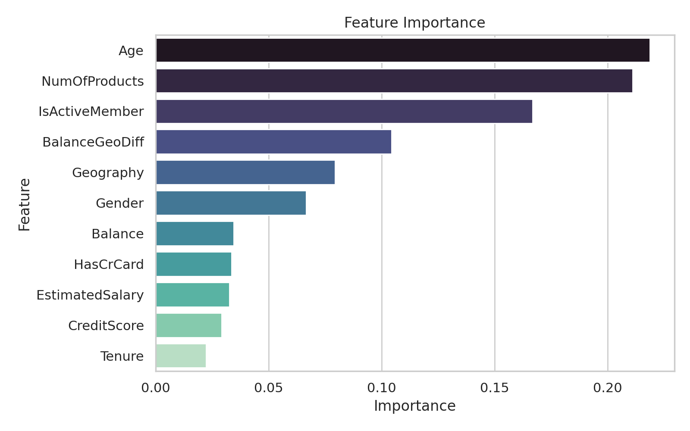
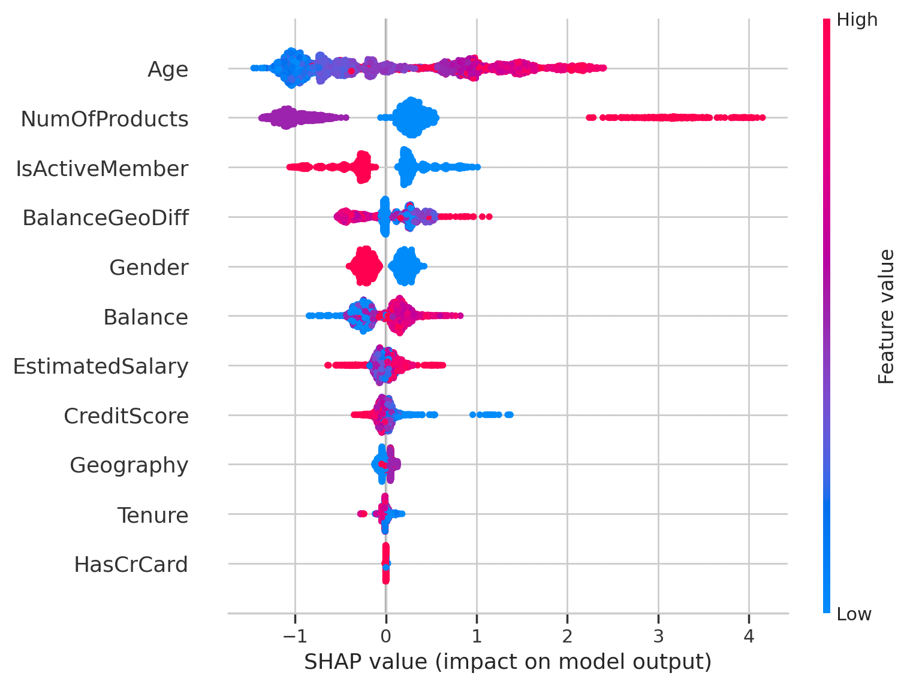

# Bank-Customer-Churn-Prediction

## Описание
Проект посвящён анализу поведения клиентов банка и прогнозированию их оттока с помощью моделей машинного обучения.
Задача — классифицировать, покинет ли клиент банк, на основе демографических и финансовых признаков.

[**Источник данных**](data/README.md)

## Содержание
- EDA и визуализация
- Phik корреляции для категориальных и числовых признаков
- Балансировка классов (downsampling)
- Обучение моделей: Logistic Regression, RandomForest, XGBoost
- Подбор гиперпараметров через GridSearchCV
- Сравнение train/test метрик, ROC и PR кривые
- SHAP-анализ для объяснимости модели
- Сохранение артефактов и итоговые выводы

## Основные результаты
- Лучшая модель: **XGBoost (AUC ≈ 0.87)** (сравнение )
- Ключевые факторы оттока:
  - `Age` — риск оттока растёт с возрастом.
  - `NumOfProducts` — клиенты с 3–4 продуктами уходят чаще.
  - `IsActiveMember` — активность клиента сильно снижает риск.
  - `BalanceGeoDiff` — отклонение баланса от среднего по стране.

## Важные графики

## 💡 Выводы
- На отток клиентов влияют возраст, активность и количество продуктов.
- Сбалансированная модель RandomForest обеспечивает наилучшее качество прогноза.
